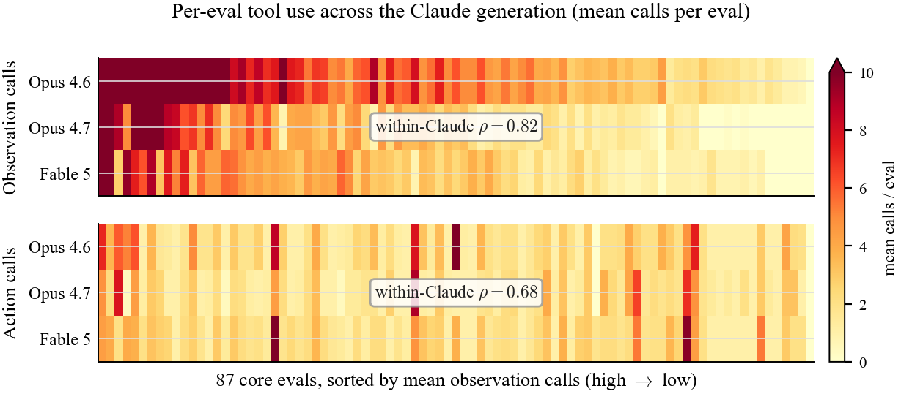
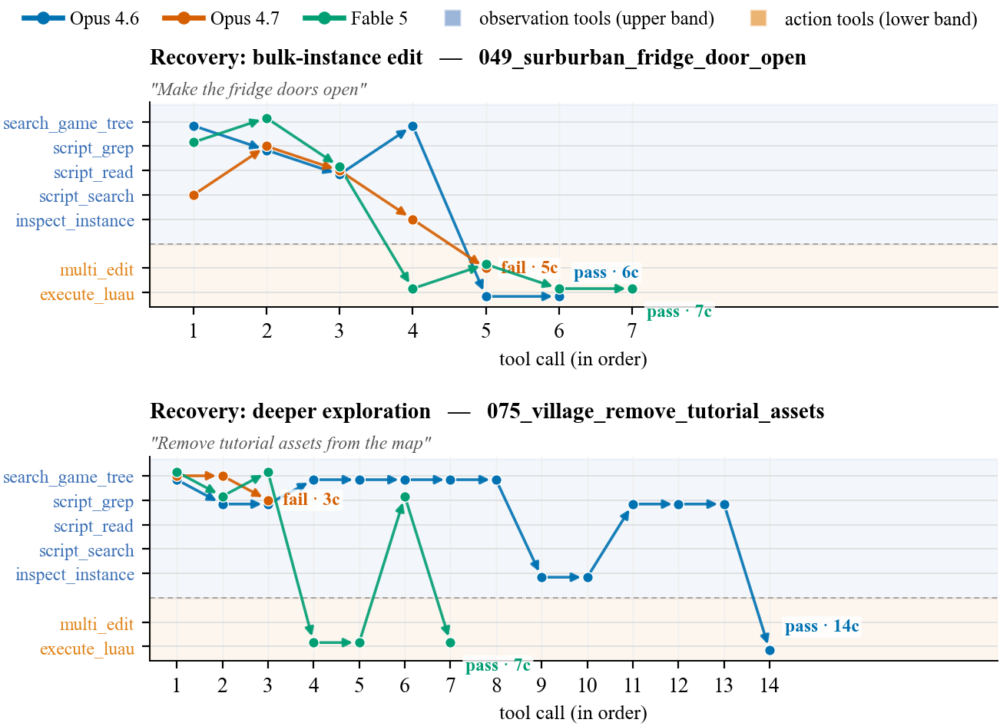

# Claude Opus 4.6 / 4.7 vs Fable 5: Eval Comparison Report

**Date**: June 10, 2026
**Eval suite**: 87 core evals + 30 debug evals (open-game-eval/Evals), k=5 runs each, timeout=300s
**Configuration**: Identical system prompt, identical tools. All three Claude models run with default reasoning settings, which default to `high`.

Fable 5 is the newest Claude flagship and the generational successor to Opus 4.7. Across the three releases the headline pass rate moves only a little, but the *way* the model investigates a scene changes: first a shallowing (Opus 4.6 → 4.7), then a switch of the main search instrument (4.7 → Fable 5).

This report focuses on those behavioral shifts. As with the 4.7-vs-4.6 review, the aggregate pass differences are mostly not statistically significant; the tool-calling differences are large and very significant.

## 1. Summary

### Key Findings

1. **Pass rate is comparable across the generations, with Fable 5 modestly ahead.** On the 87 core evals, Pass@1 runs 48.0% (4.6) → 43.4% (4.7) → 50.3% (Fable). Fable's edge over Opus 4.7 (+6.9pp) is large but not significant at our sample size (p=0.08). Compared to Opus 4.6 (+2.3pp) it remains roughly flat (p=0.51). On the 30 debug evals Fable is the strongest Claude model: Pass@1 64.7% vs 52.7% (4.7) / 50.7% (4.6).

2. **Fable holds Opus 4.7's shallow tool budget but switches search instrument.** Total tool calls collapsed from Opus 4.6 to 4.7 (9.1 → 5.5, -39%) and then stayed flat into Fable (5.4, p=0.73). Within that fixed budget Fable reorganizes *which* tools it uses: structural scene-graph traversal keeps falling (`search_game_tree` 2.11 → 1.31 → 0.90; `script_search` 0.39 → 0.17 → 0.05; `inspect_instance` 1.17 → 0.72 → 0.48), while textual code search goes back up (`script_grep` 1.31 → 0.48 → 0.82). The code-editing action tool `multi_edit` is flat throughout (~0.9).

3. **Opus walks the scene graph; Fable greps the code.** This summarizes the 4.7 → Fable change: Opus relies on `search_game_tree` traversals to locate targets structurally; Fable uses `script_grep`. At equal cost and statistically indistinguishable observation share (p=0.69), the two reach comparable outcomes through different instruments.

4. **Fable's grep-first style recovers several of the failures that cost Opus 4.7.** Three of Opus 4.7's most prominent regressions from 4.6 (`002_emit_white_smoke`, `049_surburban_fridge_door_open`, `075_village_remove_tutorial_assets`, all 100% → 0-20%) are back to 100% under Fable. Its grep-first investigation reaches a fix Opus 4.7 missed, by a different route in each: enumerating every instance, choosing the correct Roblox engine idiom the checker expects (`002`), or exploring deeper (`075`).

### Recommendations

- **Fable 5 is the strongest model on our evaluation set.** The gains are clearest on debugging (+12.0pp Pass@1) and on discovery/bulk-instance authoring where Opus 4.7 under-explored; its grep-first policy finds "all the doors / all the chimneys" that narrow searches miss.

- **Match it to bounded, well-specified tasks.** Task specificity is the strongest predictor of Fable's edge: on debug evals (one named script, one bug) it improves performance roughly 10 percentage points.

---

## 2. Overall Pass Rates

### Authoring (87 evals)

| Metric | Opus 4.6 | Opus 4.7 | Fable 5 | Δ (4.7→Fable) | p (4.7→Fable) | p (4.6→Fable) |
|--------|----------|----------|---------|---------------|---------------|---------------|
| **Pass@1** | 48.05% | 43.45% | **50.34%** | +6.9pp | 0.080 | 0.513 |
| **Pass@5** | 59.77% | 58.62% | 62.07% | +3.4pp | 0.442 | 0.640 |
| **Cons@5** | 48.05% | 43.45% | 51.09% | +7.6pp | 0.091 | 0.454 |
| **All@5** | 38.28% | 32.18% | 39.52% | +7.3pp | 0.091 | 0.711 |

### Debug (30 evals)

| Metric | Opus 4.6 | Opus 4.7 | Fable 5 | Δ (4.7→Fable) | p (4.7→Fable) | p (4.6→Fable) |
|--------|----------|----------|---------|---------------|---------------|---------------|
| **Pass@1** | 50.67% | 52.67% | **64.67%** | +12.0pp | 0.059 | 0.070 |
| **Pass@5** | 66.67% | 63.33% | 73.33% | +10.0pp | 0.184 | 0.424 |
| **Cons@5** | 49.52% | 53.14% | 66.09% | +13.0pp | 0.071 | 0.047 |
| **All@5** | 40.85% | 43.57% | 54.66% | +11.1pp | 0.099 | 0.143 |

No core-set metric reaches significance; all trend modestly upward for Fable. On debug, Fable's gain is larger and borderline-significant, and it is the strongest Claude model on bug-fixing in this suite.

### Debug evals: targeted tasks are where Fable clearly wins

A debug eval hands the model one buggy script and a clear instruction to fix it: the target is named, the scope is bounded, and success is a specific behavior. That is the shape of task Fable's grep-first, find-the-code-and-act style is built for, and the numbers reflect it:

- +12.0pp Pass@1 over Opus 4.7 (and +14.0pp over 4.6): 52.7% → 64.7%. A double-digit jump on a 30-eval suite is large, and it is mirrored across every debug metric (Pass@5 +10.0pp, Cons@5 +13.0pp, All@5 +11.1pp).
- The improvement is lopsided in Fable's favor. Against Opus 4.7, Fable improves 6 debug evals by ≥30pp and regresses only 1 (`013_inf_cube_fall_bug_2`, 80%→20%), a 6:1 ratio. On the open-ended 87-eval core set the same model is far riskier: 15 improvements against 8 regressions (≈2:1).
- Fable solves more bugs outright: it reaches 100% on 15 of 30 debug evals, versus 12 for both Opus 4.6 and 4.7. Several wins are total recoveries of bugs Opus 4.7 missed entirely: `010_left_shift_sprint_5s_bug_3` (0%→100%), `004_reduce_car_friction…_bug_1` (0%→80%), `003_make_leaves_fall_colored_bug_1` (0%→60%).
- It does this at the same shallow cost (mean tool calls 5.2 → 5.4 from 4.7 to Fable on debug), so the gains come from better-aimed search, not more searching.

On the core eval set the picture is different. When the task is vague and open-ended ("remove the tutorial assets," "make a death trap"), the same fixed grep-first budget produces a more mixed result: it recovers several discovery/bulk-instance failures (§6) but opens new regressions on tasks that hinge on getting runtime behavior exactly right (§5). Fable behaves like a specialist that wins most clearly on well-specified tasks.

---

## 3. Tool Usage

Per-eval mean call counts on the 87 core evals. p-values are paired two-sided t-tests for the generational step Opus 4.7 → Fable 5.

| Tool | Opus 4.6 | Opus 4.7 | Fable 5 | Δ (4.7→Fable) | p (4.7→Fable) | Sig |
|------|----------|----------|---------|---------------|---------------|-----|
| **Total** | **9.12** | **5.53** | **5.41** | **-0.11** | **0.732** | n.s. |
| `search_game_tree` | 2.11 | 1.31 | 0.90 | -0.41 | <10⁻³ | *** |
| `script_search` | 0.39 | 0.17 | 0.05 | -0.12 | <10⁻³ | *** |
| `inspect_instance` | 1.17 | 0.72 | 0.48 | -0.24 | 0.083 | n.s. |
| `script_grep` | 1.31 | 0.48 | 0.82 | +0.34 | <10⁻³ | *** |
| `script_read` | 1.64 | 0.74 | 0.78 | +0.04 | 0.616 | n.s. |
| `execute_luau` | 1.52 | 1.19 | 1.41 | +0.21 | 0.037 | * |
| `multi_edit` | 0.92 | 0.87 | 0.94 | +0.07 | 0.256 | n.s. |

Significance (paired t-test, Opus 4.7 → Fable): `***` p<0.001, `**` p<0.01, `*` p<0.05, `n.s.` not significant.

Total tool-call cost is flat from Opus 4.7 to Fable (p=0.73), unlike the 4.6 → 4.7 step, which cut 39% of all calls. Second, within that fixed budget the search modality rebalances: the three structural-discovery tools (`search_game_tree`, `script_search`, `inspect_instance`) all drop further, while `script_grep`, which Opus 4.7 had nearly abandoned (1.31 → 0.48), comes back (0.82), close enough to `search_game_tree` (0.90) that the two are co-primary search tools, alongside more `execute_luau`. The observation share of total calls is statistically unchanged from Opus 4.7 to Fable (51.4% → 50.6%, p=0.69); Opus 4.6 observed far more (69%), so the collapse to ~51% happened at the 4.6 → 4.7 step and then held. Fable investigates about as much as 4.7; it just investigates differently.

### Tool Error Rates

Tool error rates are low across the three releases (Opus 4.6 0.71%, Opus 4.7 1.33%, Fable 5 1.40%). Fable's rate is marginally the highest of the three but still well under 2%, consistent with its heavier use of the free-form code-execution tool `execute_luau`. The differences are small and do not drive the pass-rate picture.

### Per-eval tool-use agreement across the Claude generations

Throughout, observation tools read game state without changing it (`search_game_tree`, `script_read`, `script_grep`, `script_search`, `inspect_instance`), while action tools mutate the game state (`multi_edit`, `execute_luau`, `insert_from_creator_store`).

The per-tool means above are model-level averages; the heatmap below breaks the same data out per eval for the three Claude generations. Each cell is a model's mean call count on one of the 87 core evals, on a shared raw scale (deeper red = more calls, saturating at ~10+), so absolute differences between generations are directly visible. Evals are sorted by mean observation demand.

Which evals demand exploration is mostly determined by the task, not the generation: the observation strip is strongly coherent across the three rows (within-Claude Spearman ρ=0.82), with Opus 4.6, 4.7, and Fable 5 moving together almost cell-for-cell. The generations differ mostly in overall level: Opus 4.6's observation row is visibly hotter (more calls per eval) than the leaner 4.7 and Fable rows. Action demand (bottom, ρ=0.68) is patchier, which is where Fable's grep-first, `execute_luau`-enumerate style shows up as its own row texture.

---

## 4. Per-Eval Results

Primary comparison is the direct generational step, Fable 5 vs Opus 4.7 (Opus 4.6 shown for context).

### Improvements (Fable Pass@1 gain ≥ 30pp vs Opus 4.7): 15 evals

| Eval | 4.6 | 4.7 | Fable | Tools 4.7→Fable |
|------|-----|-----|-------|-----------------|
| `002_emit_white_smoke` | 100 | 0 | 100 | 3.0→2.6 |
| `049_surburban_fridge_door_open` | 100 | 0 | 100 | 5.2→6.6 |
| `075_village_remove_tutorial_assets` | 100 | 20 | 100 | 2.8→7.2 |
| `008_spawn_as_r6` | 100 | 40 | 100 | 5.6→2.8 |
| `027_firstperson_block` | 100 | 40 | 100 | 3.2→2.0 |
| `106_lasertag_weapon_balance` | 0 | 40 | 100 | 9.4→6.2 |
| `079_platformer_roblonk_blue_raise` | 80 | 20 | 100 | 2.6→7.2 |
| `074_red_grass_sway` | 60 | 0 | 80 | 8.0→6.0 |
| `075_create_npc_enemy` | 0 | 0 | 80 | 5.2→3.6 |
| `084_platformer_roblonk_rotate` | 0 | 0 | 80 | 1.0→3.8 |
| `092_fps_shoot_ground_bounce` | 0 | 20 | 80 | 8.2→5.4 |
| `053_surburban_billboard_change_decal` | 100 | 20 | 80 | 5.4→5.0 |
| `110_racing_car_offtrack_reset` | 0 | 20 | 80 | 30.0→17.4 |
| `043_platformer_bouncing_jumper` | 40 | 0 | 60 | 5.4→13.6 |
| `104_lasertag_mobile_camera_recoil` | 0 | 0 | 40 | 6.4→6.8 |

### Regressions (Fable Pass@1 drop ≥ 30pp vs Opus 4.7): 8 evals

| Eval | 4.6 | 4.7 | Fable | Tools 4.7→Fable |
|------|-----|-----|-------|-----------------|
| `038_platformer_coin_multiple_pickup` | 0 | 80 | 0 | 7.2→8.6 |
| `090_fps_display_target_damage_ui` | 80 | 80 | 0 | 6.0→7.6 |
| `100_obby_add_death_trap` | 20 | 60 | 0 | 2.8→6.2 |
| `025_chase_and_damage` | 0 | 100 | 20 | 2.8→3.2 |
| `107_lasertag_grenade_weapon` | 100 | 100 | 40 | 16.8→4.8 |
| `119_lasertag_add_megablaster` | 100 | 100 | 40 | 5.0→6.0 |
| `004_reduce_car_friction_enable_sliding` | 80 | 60 | 20 | 7.6→5.8 |
| `099_city_add_cars` | 40 | 100 | 60 | 6.4→4.2 |

**Stability counts (Fable vs Opus 4.7)**: 27 evals (31%) are 0% in both; 20 evals (23%) are 100% in both. (Against Opus 4.6: 11 improve, 11 regress ≥30pp; 25 both-0, 26 both-100.)

Fable's improvements concentrate on discovery / bulk-instance core tasks (the upper rows are tasks Opus 4.7 regressed on relative to 4.6), while its regressions concentrate on getting play-mode behavior exactly right (damage, movement, weapon balance).

### What the behavior looks like

The figure below traces the *ordered* tool calls of one representative run per model on two case-study evals (observation tools in the upper band, action tools in the lower band). The path shape reads as behavior: paths that stay high keep gathering information; paths that drop low are acting.

- **`049` (recovery, bulk-instance):** Opus 4.7 reads one door script and makes a single `multi_edit`, then stops (fail); Opus 4.6 and Fable both grep, then loop `execute_luau` over every door (pass). Fable reproduces 4.6's win.
- **`075` (recovery, exploration depth):** Opus 4.7's path is only 3 calls (two `search_game_tree` and a grep) before it gives up (fail). Opus 4.6 (14 calls) and Fable (7 calls) keep probing the workspace until they find and remove the `Info NPCs` folder (pass).

---

## 5. Regression Root Cause Analysis (Fable < Opus 4.7)

Fable's regressions are not under-exploration failures (its grep-first discovery is strong); they are cases where its solution does not reliably pass the play-mode check, usually because the generated runtime logic is less robust than Opus 4.7's.

### Example play-mode behavior changes which fail

**`025_chase_and_damage`** (Opus 4.7 100% → Fable 20%, tools 2.8→3.2)
- **Opus 4.7**: builds a `ChaserEntity` with a proper rig and a `ChaserEntityAI` script; all 23 checks pass, including movement-to-player and damage, on every run.
- **Fable**: builds the same entity and AI script, but only 1 of 5 runs reaches 23/23. The other four fail inconsistently: two at Check 2 ("NPCs failed to move to player"), the others at later movement checks (Check 6, Check 12), so the chaser does not reliably path to the player.

### Reinventing the existing system instead of reusing it

**`119_lasertag_add_megablaster`** (4.6 100%, 4.7 100% → Fable 40%, tools 5.0→6.0)

The scene already ships an attribute-driven weapon system: the existing `AutoBlaster`/`Blaster` tools keep their stats in instance attributes (`damage`, `magazineSize`, `_ammo`, `rateOfFire`, `range`, `spread`, `fireMode`, …), and Check 6 requires the new `MegaBlaster` to carry at least one of `damage`/`magazineSize`/`_ammo`/`fireMode`.
- **Opus 4.7** (and 4.6): every run clones an existing blaster and boosts those attributes, so the MegaBlaster stays inside the attribute system, and all 9 checks pass (5/5).
- **Fable**: split behavior. In 2 of 5 runs it likewise clones `AutoBlaster` and bumps the attributes (`damage=25`, `magazineSize=60`, …), reaching 9/9. In the other 3 runs it instead builds the tool from scratch with `Instance.new("Tool")` and its own scripted firing logic, but never sets the stat attributes, so it fails Check 6 ("MegaBlaster must have basic weapon attributes"). The regression is an integration-consistency gap: Fable sometimes reuses the existing weapon system and sometimes reinvents it without the attributes that system (and the check) expects.

---

## 6. Improvements (Fable > Opus 4.7)

Fable's gains come from grep-first investigation that reaches a fix Opus 4.7 missed: sometimes by enumerating every matching instance, sometimes by exploring deeper, sometimes by choosing the engine idiom the eval's checker expects. These map onto the bulk-instance and under-exploration failure modes documented for Opus 4.7 in the 4.7-vs-4.6 review.

### Bulk-instance recovery (grep + enumerate)

**`049_surburban_fridge_door_open`** (4.6 100%, 4.7 0% → Fable 100%, tools 5.2→6.6)
- **Opus 4.7**: grepped/read the fridge door script, then `multi_edit` on a single `StoreFridgeDoorScript` path, so only one of six doors changed; Check 2 fails (all 5 runs).
- **Fable**: greps `"fridge"`, traverses, reads the script, then uses `execute_luau` to enumerate every door under `Refridgerators` and propagate the fix, plus a verification pass. All 6/6 door checks pass on every run.

### Exploration-depth recovery

**`075_village_remove_tutorial_assets`** (4.6 100%, 4.7 20% → Fable 100%, tools 2.8→7.2)
- **Opus 4.7**: two keyword `search_game_tree` calls plus one grep, concludes there is nothing more to remove, and stops; the `Info NPCs` folder remains, so "not all tutorial assets removed."
- **Fable**: keyword search and grep, then a broad depth-3 `search_game_tree` of Workspace that surfaces the `Info NPCs` folder, removes it with `execute_luau`, and re-greps to confirm. Check passes on all runs. This is the broad-listing step Opus 4.6 did and 4.7 skipped: Fable spends more calls here (2.8 → 7.2) and gets it right.

### Correct engine idiom

**`002_emit_white_smoke`** (4.6 100%, 4.7 0% → Fable 100%, tools 3.0→2.6)
- Both models use the same two-call shape and the identical three `chimneyPaths` found by search, so this is not an enumeration-breadth difference. **Opus 4.7** places a `ParticleEmitter` with a white smoke texture;  **Fable** places a native `Instance.new("Smoke")` object (white). The win is coming from picking the native engine idiom.

---

## 7. Interpretation

Across the three Claude generations, pass rate is roughly stable while the investigation policy changes twice:

| Dimension | Opus 4.6 | Opus 4.7 | Fable 5 |
|-----------|----------|----------|---------|
| Tool calls per eval | 9.1 | 5.5 | 5.4 |
| Exploration depth | Deep, persistent | Shallow, targeted | Shallow, targeted |
| Primary search instrument | Scene-graph traversal + grep | Scene-graph traversal | **Scene-graph + revived grep** |
| Observation share | 69% | 51% | 51% |
| Characteristic failure | Over-engineering, wrong idioms | Under-exploration, narrow fixes | Runtime-behavior misses |
| Strength | Open-ended discovery | Well-specified targeted tasks | Bulk-instance + debugging |

Opus 4.6 → 4.7 was a major change: the model became much less likely to explore using its tools, and potentially cheaper to run, at the cost of under-exploration regressions. Opus 4.7 → Fable 5 is a modality change at the same tool-call budget: Fable keeps the efficiency improvements in search tools but rebalances towards code grep. This substantially mitigates Opus 4.7's most visible failure mode (narrow, single-instance edits) and makes Fable the strongest Claude model on this suite, especially on debugging, while opening a smaller new weakness on tasks that expect specific runtime behavior (we observe 8 regressions ≥30pp against Opus 4.7). 

The split is sharpest by task specificity: on the bounded debug evals (one named script, one bug) Fable is a clean +12pp improvement with a 6:1 improvement-to-regression ratio, whereas on open-ended core tasks the same fixed grep-first budget both recovers and regresses.